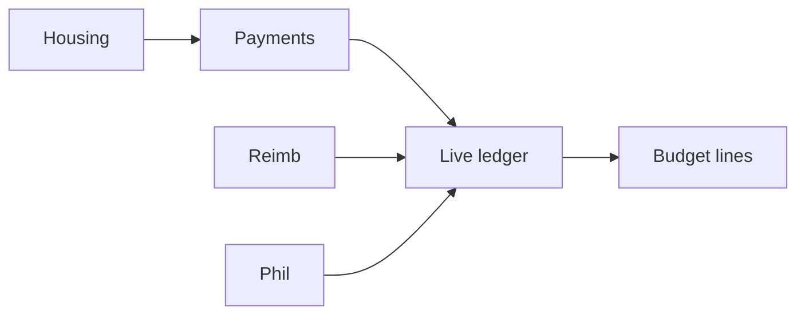

# TouseOS product status (realistic)

Last updated: Launch readiness sweep on `cursor/launch-readiness-sweep-4a50`.

## How to read these numbers

We separate **“exists in the repo”** from **“works end-to-end without dead ends.”** File/route counts alone overstate what a treasurer or member can complete in the app.

| Metric | Realistic % | Meaning |
|--------|-------------|---------|
| **Backlog modules with a route or API** | **~89%** | Page or endpoint exists (66/67 modules; module 66 = launch QA) |
| **Connected user journeys** | **~85%** | Active org + REST APIs; settings, risk, alumni, big-little on APIs |
| **Production-ready depth** | **~55%** | CI build, RBAC on new routes, launch env validation |
| **Launch-ready** | **~58%** | Runbook, `/api/ready`, checklist code-complete; live Stripe/QA pending |

### Overall product complete (recommended single number)

**~74%** — weighted blend:

| Component | Weight | Score | Contribution |
|-----------|--------|-------|--------------|
| Connected journeys | 40% | 85% | 34.0 |
| Routes / APIs exist | 20% | 89% | 17.8 |
| Production depth | 25% | 55% | 13.8 |
| Launch readiness | 15% | 58% | 8.7 |
| **Total** | 100% | — | **~74.3% → ~74%** |

Round to **~74%** for stakeholder updates. **Launch-ready** alone is **~58%** until migrations, Stripe, and pilot smoke tests are done in production. Do not quote **~89%** as “the product is done” — that is surface area only.

## By product area

| Area | Connected | Notes |
|------|-----------|--------|
| Auth & onboarding | **~72%** | Signup, create-org, join; product home routing; demo needs seed |
| Greek chapter ops | **~78%** | Roster, events, tasks, comms, standards, engagement, transition |
| Finance (payments ↔ budget ↔ reimbursements) | **~78%** | APIs + budget sync; treasurer reconciliation |
| SportsOS | **~68%** | Tryouts API, travel, waivers export, coaches via members API |
| ClubOS | **~63%** | Elections, service hours, membership; thinner than Greek/Sports |
| GreekMatch / social | **~60%** | Photo APIs; storage upload on social; calendar prefill |
| Reports & exports | **~75%** | CSV exports via APIs (no client Supabase on reports page) |
| Admin / platform | **~50%** | Platform admin behind email allowlist |

## Launch readiness sweep (latest)

- `GET /api/ready` — public deploy health (env checks, webhooks, cron docs)
- `npm run launch:check` — local required-env validator
- `docs/launch-runbook.md`, updated `docs/launch-checklist.md` (code-complete items marked)
- GitHub Actions: `typecheck`, `lint`, `build` on PR/push to `main`
- APIs: `/api/org/settings`, `/api/org/memberships`, `/api/risk/checklists`, `/api/big-little/matches`, `POST /api/alumni`
- Pages wired: settings (org + members), risk checklists, alumni, big-little

## Wave 25

- APIs: tryouts, transition, event RSVPs bulk, member-points, alumni GET, waivers GET
- Pages: tryouts, transition, engagement, reports, attendance-points

## Wave 24

- `requireOrgProduct` uses active org cookie
- Yearbook export, GreekMatch profile save, event detail org guard
- Standards, travel, big-little, attendance, engagement, risk APIs

## Still open (honest backlog)

| Priority | Item |
|----------|------|
| P1 | Merge wave branches to `main`; run migrations **001–024**; set production env; `curl /api/ready` |
| P2 | Client Supabase remains on: profile, budget, GreekMatch, feed, documents (storage), server pages |
| P2 | Dashboard still server-side Supabase (summary API ready for refactor) |
| Launch | Counsel review of terms/privacy; Stripe + `SUPABASE_SERVICE_ROLE_KEY` in prod |

## Environment

| Variable | Why |
|----------|-----|
| `SUPABASE_SERVICE_ROLE_KEY` | Org create, budget auto-sync on webhooks |
| Stripe + webhook | Card payments → budget |
| `005_seed.sql` | Demo chapter for onboarding |

## Finance flow (target state)

## Related docs

- Module checklist: `docs/backlog-status.md`
- Launch: `docs/launch-checklist.md`
