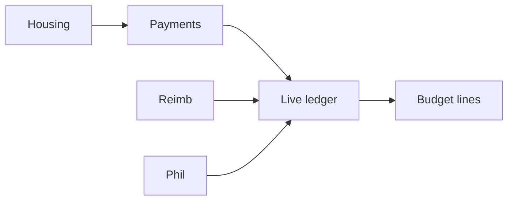

# TouseOS product status (realistic)

Last updated: connection-fix pass on `cursor/connection-fixes-4a50`.

## How to read these numbers

We separate **“exists in the repo”** from **“works end-to-end without dead ends.”** Earlier ~86% figures counted routes/APIs; that overstates what a treasurer or member can actually complete in the app.

| Metric | Realistic % | Meaning |
|--------|-------------|---------|
| **Backlog modules with a route or API** | **~88%** | Page or endpoint exists |
| **Connected user journeys** | **~62%** | Primary flows link correctly; few 404s or wrong redirects |
| **Production-ready depth** | **~48%** | Tested, permissioned, env-configured, counsel-ready legal copy |
| **Launch-ready** | **~42%** | Migrations, Stripe, QA, mobile polish, legal |

**Best single number for “how done is the product?” → ~55–60%** (weighted toward connected journeys, not file count).

## By area

| Area | Connected | Notes |
|------|-----------|--------|
| Auth & onboarding | **~70%** | Signup, create-org, join; `/home` routes sports/club correctly; demo needs seed |
| Greek chapter ops | **~75%** | Members, events, attendance, tasks, comms |
| Finance (payments ↔ budget ↔ reimbursements) | **~68%** | Ledger + sync; cross-links added; reimbursements still update via Supabase + sync-org hook |
| SportsOS | **~65%** | Home, travel detail links; shared finance modules work |
| ClubOS | **~60%** | Club home, elections, service hours; thinner than Greek/Sports |
| GreekMatch / social | **~55%** | Profile tab deep links fixed; some actions still toast-only |
| Admin / platform | **~50%** | Platform admin behind email allowlist |

## Fixed in this pass (dead ends)

- `/terms`, `/privacy` pages (signup links)
- `/home` → correct product home (Greek dashboard vs `/sports` vs `/club`)
- Sports/club users no longer stuck on Greek `/dashboard` after login or onboarding
- Org switcher sets active org cookie and navigates to the right home
- GreekMatch “Edit profile” → `/profile?tab=greekmatch`
- Budget housing link hidden for sports/club (was guard-blocked)
- Sports upcoming trips → `/travel/[id]`
- Finance cross-links: budget ↔ payments ↔ reimbursements ↔ housing ↔ philanthropy
- Reimbursement approve/paid triggers budget sync-org API
- Treasurer dashboard links split budget vs reimbursements

## Still open (honest backlog)

| Priority | Item |
|----------|------|
| P1 | Reimbursements + some modules still use Supabase client instead of APIs (sync hooks added where critical) |
| P1 | Multi-org GreekMatch: profile tab visible if any Greek org, guard uses primary org type |
| P1 | Duplicate monthly rent charges (no month dedupe) |
| P2 | Event share / duplicate QR buttons on event detail |
| P2 | Social calendar query params from asset composer |
| P2 | Orphan API routes (tasks, documents, notifications) — UI uses Supabase directly |
| Launch | Replace placeholder terms/privacy; run migrations **015–024** |

## Environment

| Variable | Why |
|----------|-----|
| `SUPABASE_SERVICE_ROLE_KEY` | Org create, budget auto-sync on webhooks |
| Stripe + webhook | Card payments → budget |
| `005_seed.sql` | Demo chapter for onboarding |

## Finance flow (target state)

Officers should be able to: charge → collect → see budget update → approve reimbursement → see expense line — without manual “sync only dues” dead ends.

## Related docs

- Module checklist: `docs/backlog-status.md`
- Launch: `docs/launch-checklist.md`
