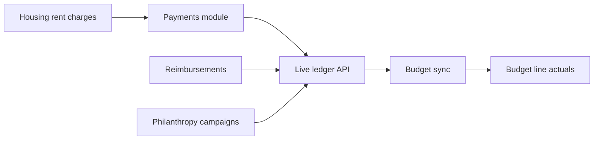

# TouseOS product status

Where the build stands today — by **milestone**, not calendar dates. Use this to decide when to polish vs ship.

**Branch:** `cursor/sportsos-clubos-separation-4a50` · **Backlog detail:** `docs/backlog-status.md`

## Overall

| Area | Status | Notes |
|------|--------|-------|
| **Platform completeness** | ~**86%** | 67 backlog modules; most have routes/APIs |
| **Day-to-day chapter ops** | ~**94%** | Members, events, payments, comms, officers |
| **Finance interconnect** | ~**75%** | Wave 14: unified ledger + auto-sync (this PR) |
| **Launch readiness** | ~**70%** | Needs env keys, migrations, QA pass |

## Milestone map

### Done (production-depth)

- **Core GreekOS:** dashboard, members, events, attendance, tasks, documents, messaging
- **Payments:** Stripe checkout, manual pay, plans, parent pay, hardship, reconciliation
- **Reimbursements:** submit → approve → paid workflow
- **Budget:** lines, alerts, cash flow, event P&L, per-member cost, HTML/CSV export
- **Philanthropy, forms, alumni, parent portal, notifications**
- **SportsOS:** roster, travel trip workspace, eligibility, readiness
- **ClubOS:** membership, committees, service hours, elections, goals
- **Product skins:** TouseGreek / SportsOS / ClubOS nav + route guards
- **Onboarding:** create-org page + API + cookie active org

### In progress (this wave — finance glue)

| Item | Status |
|------|--------|
| Live finance ledger on Budget (payments + reimbursements + philanthropy) | ✅ |
| Auto-sync budget when payments/reimbursements/philanthropy change | ✅ (needs `SUPABASE_SERVICE_ROLE_KEY`) |
| All payment categories → budget income lines (dues, housing, travel, etc.) | ✅ |
| Housing “Post monthly rent” → `housing` payments → Budget “Housing & rent” | ✅ |
| Default budget line templates on new budget | ✅ |

### Next (finish product, then cleanup)

1. **QA finance flows** — create charge → pay (Stripe/cash) → confirm budget line updates; reimbursement paid → expense line
2. **Housing polish** — avoid duplicate rent charges same month; optional reminder notifications
3. **Permissions audit** — treasurer vs member on budget sync API
4. **Mobile pass** — budget ledger tab on small screens
5. **Launch** — run migrations **015–024**, Stripe webhook URL, `docs/launch-checklist.md`

### Backlog (not blocking “finish product”)

- Deeper SportsOS (NCAA forms, equipment inventory)
- ClubOS CRM / sponsor pipeline
- Native apps, advanced analytics warehouse

## Environment

| Variable | Why |
|----------|-----|
| `SUPABASE_SERVICE_ROLE_KEY` | Org create fallback, budget auto-sync after webhooks |
| Stripe keys + webhook | Card payments → budget |
| Migrations **015 → 024** | Onboarding RPC, ClubOS, elections, sports travel RLS |

## How finance works now

Officers open **Budget & Finance** → see the live ledger → lines auto-update from Payments, Reimbursements, and philanthropy. Use **Sync all** to force a refresh.

## Related PRs

- [#27](https://github.com/AmanAnoop/TouseOS/pull/27) — Waves 6–12 backlog continuation  
- [#28](https://github.com/AmanAnoop/TouseOS/pull/28) — SportsOS/ClubOS separation, org create fix, Wave 13 + finance interconnect
