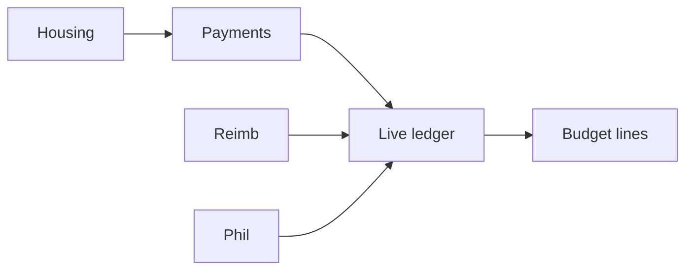

# TouseOS product status (realistic)

Last updated: Wave 22 on `cursor/wave22-dashboard-housing-rsvp-4a50`.

## How to read these numbers

We separate **“exists in the repo”** from **“works end-to-end without dead ends.”** Earlier ~86% figures counted routes/APIs; that overstates what a treasurer or member can actually complete in the app.

| Metric | Realistic % | Meaning |
|--------|-------------|---------|
| **Backlog modules with a route or API** | **~88%** | Page or endpoint exists |
| **Connected user journeys** | **~76%** | Dashboard, settings, housing, RSVP, and payments respect active org + APIs |
| **Production-ready depth** | **~50%** | Tested, permissioned, env-configured; legal summaries expanded (counsel review still needed) |
| **Launch-ready** | **~44%** | Migrations, Stripe, QA, mobile polish, counsel-approved legal |

**Best single number for “how done is the product?” → ~62–67%** (weighted toward connected journeys, not file count).

## By area

| Area | Connected | Notes |
|------|-----------|--------|
| Auth & onboarding | **~70%** | Signup, create-org, join; `/home` routes sports/club correctly; demo needs seed |
| Greek chapter ops | **~75%** | Members, events, attendance, tasks, comms |
| Finance (payments ↔ budget ↔ reimbursements) | **~76%** | Payments list via API; reimbursements + budget sync |
| SportsOS | **~65%** | Home, travel detail links; shared finance modules work |
| ClubOS | **~60%** | Club home, elections, service hours; thinner than Greek/Sports |
| GreekMatch / social | **~58%** | Multi-org GreekMatch access; social calendar prefill from assets |
| Admin / platform | **~50%** | Platform admin behind email allowlist |

## Fixed in this pass (dead ends)

- `/terms`, `/privacy` pages (signup links)
- `/home` → correct product home (Greek dashboard vs `/sports` vs `/club`)
- Sports/club users no longer stuck on Greek `/dashboard` after login or onboarding
- Org switcher sets active org cookie and navigates to the right home
- GreekMatch “Edit profile” → `/profile?tab=greekmatch`
- Budget housing link hidden for sports/club (was guard-blocked)
- Sports upcoming trips → `/travel/[id]`
- Finance cross-links: budget ↔ payments ↔ reimbursements ↔ housing ↔ philanthropy
- Reimbursement approve/paid triggers budget sync-org API
- Treasurer dashboard links split budget vs reimbursements

## Wave 22 (latest)

- Greek dashboard uses active org cookie (`loadActiveMembershipServer`)
- Settings and travel trip detail use `useOrg()`
- Housing loads via `GET /api/housing`; payments roster via `/api/members`
- Event RSVP scoped to org via `/api/events/rsvp`

## Wave 21

- PNM pipeline uses `/api/pnm`; roster export and club committees use `/api/members`
- Governance meetings + votes via `/api/governance/*`; hardship submit via `POST /api/hardship`
- Active org on event memories, social assets, engagement, events/new, club modules, roster detail guard

## Wave 20

- Remaining chapter/sports pages use `useOrg()` (transition, PNM, reports, interchapter, alumni, big-little, coaches, standings, tryouts, payment plans/hardship, social collab, tournaments tools)
- Server pages: yearbook, NME, tournaments use `loadActiveMembershipServer`

## Wave 19

- Roster via `GET /api/members`; forms via forms API; philanthropy via `/api/philanthropy`
- Feed server page uses active org cookie (`loadActiveMembershipServer`)
- Active org on health, governance, social, risk, standards, attendance points, and more

## Wave 18

- Payments list loads via `GET /api/payments`
- Comms announcements via `/api/comms/announcements` (list + post with audit log)
- Events list via `/api/events` with active org
- Active org cookie on housing, travel, vendors, equipment, injuries, waivers, social calendar

## Wave 17

- Tasks, documents, notifications UIs wired to their REST APIs
- `useOrg` + `loadActiveMembership` respect active org cookie app-wide
- Budget, payments, reimbursements use active org (not first membership row)
- Task detail attachments update via tasks API; “My tasks” filter fixed

## Wave 16

- Reimbursements page uses `/api/reimbursements` for list, submit, approve, reject, and mark paid
- Officer permission checks on PATCH; president approval for amounts over threshold
- Budget auto-sync triggered server-side (no separate client sync-org call)
- Active org cookie respected when loading reimbursements and events
- Terms & privacy expanded with structured beta-ready summaries

## Wave 15

- Housing rent: skip members already billed for the same month label
- Event detail: working share (Web Share API or clipboard); removed duplicate QR control
- Social calendar: opens draft composer from `?title=` / `?caption=` (asset library)
- GreekMatch: sports/club active org can open `/greekmatch` when user belongs to a fraternity/sorority

## Still open (honest backlog)

| Priority | Item |
|----------|------|
| P2 | Many pages still load data via Supabase client (events, comms, housing, etc.) |
| Launch | Counsel review of terms/privacy; run migrations **015–024** |

## Environment

| Variable | Why |
|----------|-----|
| `SUPABASE_SERVICE_ROLE_KEY` | Org create, budget auto-sync on webhooks |
| Stripe + webhook | Card payments → budget |
| `005_seed.sql` | Demo chapter for onboarding |

## Finance flow (target state)

Officers should be able to: charge → collect → see budget update → approve reimbursement → see expense line — without manual “sync only dues” dead ends.

## Related docs

- Module checklist: `docs/backlog-status.md`
- Launch: `docs/launch-checklist.md`
